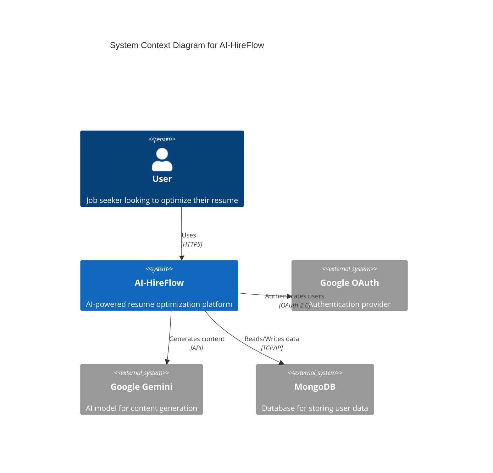
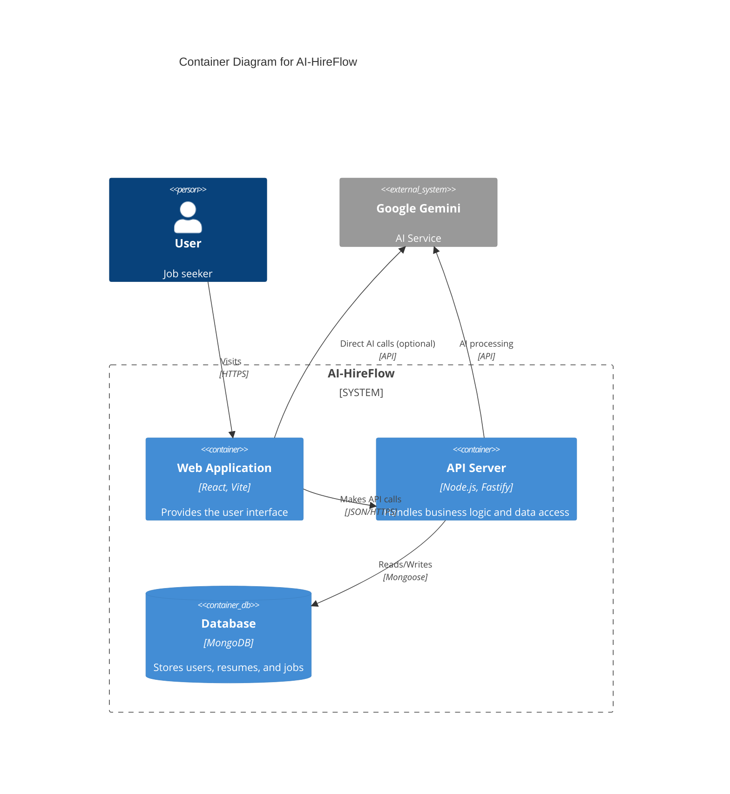
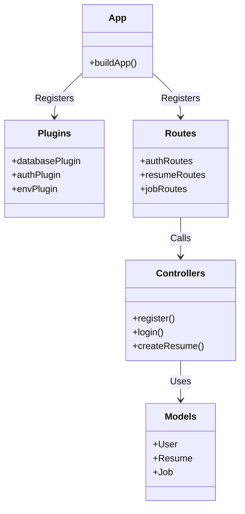

# System Architecture

## System Context Diagram

```mermaid
C4Context
    title System Context Diagram for AI-HireFlow

    Person(user, "User", "Job seeker looking to optimize their resume")
    System(aiHireFlow, "AI-HireFlow", "AI-powered resume optimization platform")
    System_Ext(googleAuth, "Google OAuth", "Authentication provider")
    System_Ext(gemini, "Google Gemini", "AI model for content generation")
    System_Ext(mongo, "MongoDB", "Database for storing user data")

    Rel(user, aiHireFlow, "Uses", "HTTPS")
    Rel(aiHireFlow, googleAuth, "Authenticates users", "OAuth 2.0")
    Rel(aiHireFlow, gemini, "Generates content", "API")
    Rel(aiHireFlow, mongo, "Reads/Writes data", "TCP/IP")
```

## Container Diagram

```mermaid
C4Container
    title Container Diagram for AI-HireFlow

    Person(user, "User", "Job seeker")

    System_Boundary(c1, "AI-HireFlow") {
        Container(webApp, "Web Application", "React, Vite", "Provides the user interface")
        Container(api, "API Server", "Node.js, Fastify", "Handles business logic and data access")
        ContainerDb(database, "Database", "MongoDB", "Stores users, resumes, and jobs")
    }

    System_Ext(gemini, "Google Gemini", "AI Service")

    Rel(user, webApp, "Visits", "HTTPS")
    Rel(webApp, api, "Makes API calls", "JSON/HTTPS")
    Rel(api, database, "Reads/Writes", "Mongoose")
    Rel(webApp, gemini, "Direct AI calls (optional)", "API")
    Rel(api, gemini, "AI processing", "API")
```

## Component Diagram (API Server)

```mermaid
classDiagram
    class App {
        +buildApp()
    }
    class Plugins {
        +databasePlugin
        +authPlugin
        +envPlugin
    }
    class Routes {
        +authRoutes
        +resumeRoutes
        +jobRoutes
    }
    class Controllers {
        +register()
        +login()
        +createResume()
    }
    class Models {
        +User
        +Resume
        +Job
    }

    App --> Plugins : Registers
    App --> Routes : Registers
    Routes --> Controllers : Calls
    Controllers --> Models : Uses
```
